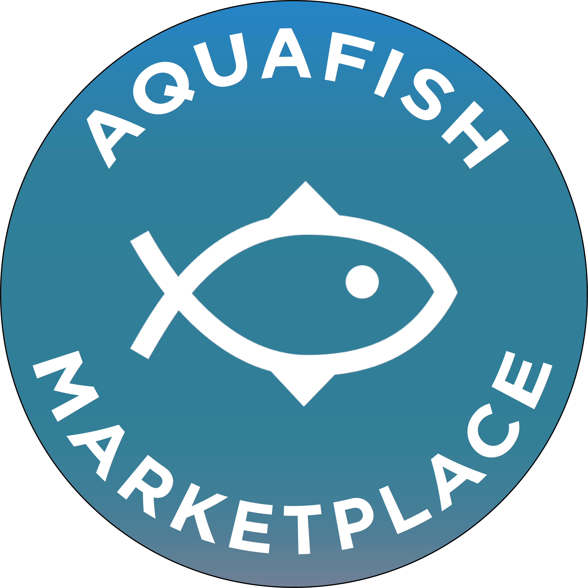

<!-- Logo Proyek -->
 

  

  <h3 align="center">Aquafish Marketplace</h3>

  

    Aquafish Marketplace adalah sebuah pasar online atau <i>marketplace</i> yang bergerak di bidang jual beli ikan hias
  

<!-- Daftar Isi -->

  
<h2 style="display: inline-block">Daftar Isi</h2>

  <ol>
    <li><a href="#anggota-tim">Anggota Tim</a></li>
    <li><a href="#fungsi">Fungsi</a></li>
    <li><a href="#tujuan">Tujuan</a></li>
    <li><a href="#target-pengguna">Target Pengguna</a></li>
    <li><a href="#mockup-kasar">Mockup Kasar</a></li>
    <li><a href="#skema-database">Skema Database</a></li>
  </ol>

<!-- Anggota Tim -->
## Anggota Tim
| NPM           | Name        |
| ------------- |-------------|
| 140810200003  | Affan Rifqy Kurniadi    |
| 140810200023  | Rheza Pandya Andhikaputra    |
| 140810200061  | Andyka Baswara Putra   |

<!-- Fungsi -->
## Fungsi

Adapun fungsi pengguna dari website ini, yaitu :
1. Sebagai platform untuk jual beli ikan hias dengan mudah.
2. Sebagai media informasi mengenai ikan hias.

<!-- Tujuan -->
## Tujuan

Adapun tujuan pengguna dari website ini, yaitu :
1. Mengakomodir sebuah platform untuk mempermudah orang yang ingin menjual dan membeli ikan hias.
2. Mengakomodir sebuah platform untuk mempermudah orang yang ingin mencari tahu informasi tentang ikan hias.

<!-- Target Pengguna -->
## Target Pengguna

Adapun target pengguna dari website ini, yaitu :
1. Orang yang ingin membeli ikan hias.
2. Orang yang ingin menjual ikan hias.
3. Orang yang ingin mencari tahu tentang ikan hias.

<!-- Mockup Kasar -->
## Mockup Kasar
Figma :
https://www.figma.com/file/obyh4T3e91S0MCShxmrTF3/Project-Pemrogaman-Web?node-id=0%3A1

<!-- Skema Database -->
## Skema Database

Skema Database Sementara

